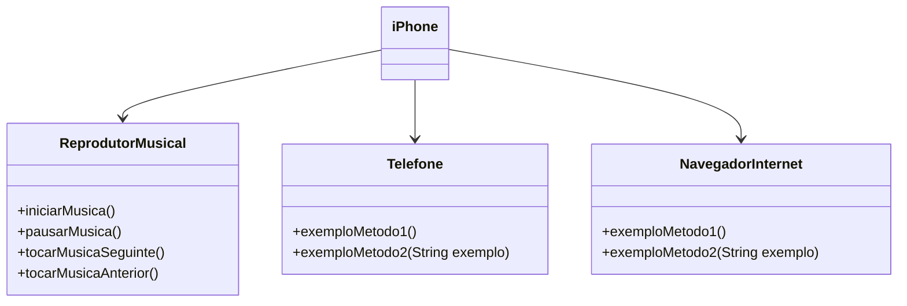

<h1>Modelando o iPhone com UML: Funções de Músicas, Chamadas e Internet</h1>

 

<h2>Regras do Desafio</h2>

* [Arquivo do Desafio](./Desafio.md)

 

<h2>Diagrama de Classe</h2>

```mermaid
classDiagram

    class ReprodutorMusical {
        +iniciarMusica()
        +pausarMusica()
        +tocarMusicaSeguinte()
        +tocarMusicaAnterior()
    }

    class Telefone {
        +exemploMetodo1()
        +exemploMetodo2(String exemplo)
    }

    class NavegadorInternet {
        +exemploMetodo1()
        +exemploMetodo2(String exemplo)
    }

    class iPhone {
        
    }

    iPhone --> ReprodutorMusical
    iPhone --> Telefone
    iPhone --> NavegadorInternet
```

 