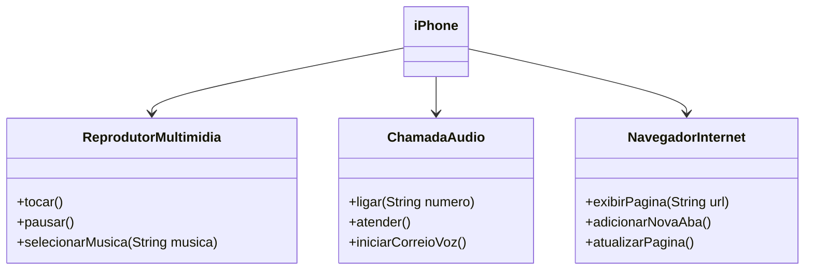

<h1>Modelando o iPhone com UML: Funções de Músicas, Chamadas e Internet</h1>

 

Modelagem e construção de programa em Java, baseado no marco histórico da geração de 
smartphones pelo toque, unificando as funcionalidades de Navegador, Player Multimídia e 
Telefone num único aparelho que cabe na palma da mão.

 

<h2>Regras do Desafio</h2>

* [Arquivo do Desafio](./POO-DESAFIO.md)

 

<h2>Diagrama de Classe</h2>

 