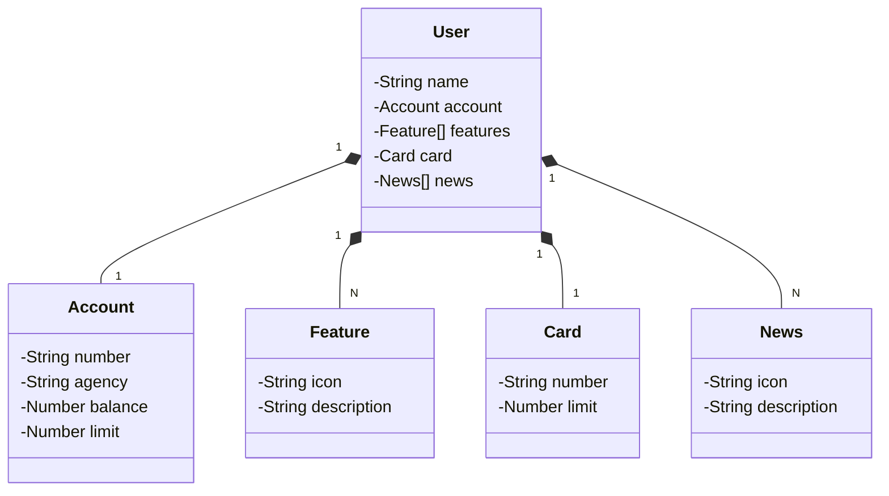

<h1>Publicando Sua API REST na Nuvem Usando Spring Boot 3, Java 17 e Railway</h1>

 

  Criação de uma API RESTful para Conta de Banco com Java, Spring Boot e hospedagem na Railway.

 

<h2>DESIGN</h2>

<h4>
  O Figma foi utilizado para a abstração do domínio desta API, sendo útil na análise e projeto da solução.
</h4>

<a href="" target="_blank">
  🔗 Link do Figma
</a>

 

<h2>DIAGRAMA</h2>

 

<h2>FERRAMENTAS & TECNOLOGIAS UTILIZADAS</h2>

<ul style="list-style-type:circle">
    <li>
      <a href="https://start.spring.io/#!type=gradle-project&language=java&platformVersion=3.3.2&packaging=jar&jvmVersion=21&groupId=com.example&artifactId=demo&name=demo&description=Demo project for Spring Boot&packageName=com.example.demo&dependencies=web,data-jpa,h2,postgresql" target="_blank">
        Spring Boot
      </a>
    </li>
    <li>
      <a href="https://www.jetbrains.com/idea/" target="_blank">
        IntelliJ IDEA
      </a>
    </li>
    <li>
      <a href="https://github.com/springdoc/springdoc-openapi" target="_blank">
        Swagger
      </a>
    </li>
    <li>
      <a href="https://railway.app?referralCode=XpQeQM" target="_blank">
        Railway
      </a>
    </li>
</ul>

 